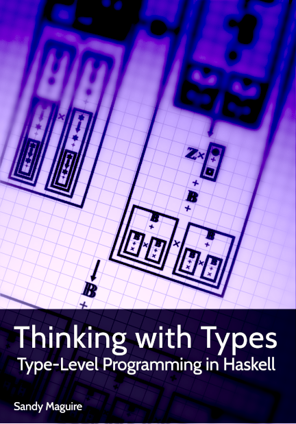

## Agenda

* Introduktion till Funktionell Programmering
* Ren Funktionell Programmering med Haskell
  * massvis av ~~abstrakt nonsens~~ kod.
* Live-kod

<div class="notes">
This is my note.

- It can contain Markdown
- like this list

</div>

## Programmera med matematiska funktioner

En funktion \\( f : A \\rightarrow B \\) är en relation från \\(A\\) till
\\(B\\) som definerar exakt ett element i \\(B\\) till varje element i \\(A\\).

```{.haskell}
data A = A1 | A2 

data B = B1 | B2

f :: A -> B
f A1 = B1
f A2 = B2
```

## Funktioner

I Haskell defineras en funktion som en ekvation.

```{.haskell}
square x = x * x

p = square 2
```

## Referenstransparens

Likhet innebär att vi kan byta ut square x för x * x och vice versa.
Detta kallas ofta för _referenstransparens_.

```{.haskell}
square x = x * x

p = square 2
```
. . .
```{.haskell}
p = 2 * 2
```
. . .
```{.haskell}
p = 4
```
Dubbelriktad substitution är alltid möjligt eftersom Haskell är rent.</br>
Ett Haskell-program är ett enda stort referentiellt transparent uttryck.

## Imperativa program kan vara svåra att resonera om

```{.c}
int c = 1;

int addOne(int x) {
  return x + c;
}

int addTwo(int x) {
  c++;
  return x + c;
}

addOne(1); // 2
addTwo(2); // 4
addTwo(3); // 6
```
Rena funktionella språk som Haskell saknar tilldelningssatser.

## Refaktorering
Eftersom vi inte behöver ta hänsyn till sidoeffekter kan vi alltid simplifiera
ett program utan att dess egenskaper förändras.

```{.haskell}
p = f x + f y * (f x - f x)
```
. . . 

```{.haskell}
p = f x + f y * 0
```

. . . 

```{.haskell}
p = f x + 0
```

. . . 

```{.haskell}
p = f x
```

## Ekvationella resonemang
Funktionell programmering och referenstransparens möjliggör för ekvationella
resonemang om ett programs egenskaper.

```{.haskell}
reverse :: [a] -> [a]
reverse []     = []
reverse (x:xs) = reverse xs ++ [x]
```
. . . 

Vi kan bevisa att: \\(\\forall x. reverse [x] = [x]\\)

```{.haskell}
reverse [x]
reverse (x: [])
reverse [] ++ [x]
[] ++ [x]
[x]
```

## Komposition

\\((f \\circ g) x = f (g(x))\\)

. . .
```{.haskell}
(.) :: (b -> c) -> (a -> b) -> (a -> c)
```

. . .
```{.haskell}
reverseSort :: [a] -> [a]
reverseSort = reverse . sort
```

```{.haskell}
> reverseSort [4,1,2] -- reverse (sort [4,1,2])
[4,2,1]
```
Med sido-effekter hade komposition ej vart möjligt.

## Vad är Haskell?
* Släpptes första gången år 1990.
  * Haskell 1.0 (1990)
  * Haskell 2010 (Senaste)
  * GHC 8.6.3 (December 2018)
  * Fick sitt namn efter den amerikanska logikern Haskell Curry
* Rent, funktionell programmeringsspråk med lat evaluering.
* Stark statisk typning med typinferens.
* Tolkat såväl som kompilerat.
  * GHCi är en REPL där Haskell-kod kan tolkas.
  * Källkod simpliferas till GHC-Core och optimeras.
    * GHC-Core är en typad lambdacalculus kallad System FC
  * GHC-Core kompileras till maskinkod.
* Utbyggbart per design.
* Ledande inom programmeringsspråk-utveckling.

## Komma igång 
[http://www.haskell.org/downloads](http://www.haskell.org/downloads)

* **Haskell Stack**
* Haskell Platform
* GHC

## Böcker

```{=html}
<div class="row">
  <div class="column">
    
  </div>
  <div class="column">
    
  </div>
  <div class="column">
    
  </div>
  <div class="column">
    
  </div>
</div>
```

## Ren Funktionell Programmering <br/> med haskell


## Haskell och IO


## Haskell och IO

I Haskell är en effekt ett första-klassens värde.
```{.haskell}
getLine :: IO String             -- En effekt som producerar en `String`

putStrLn :: String -> IO ()      -- En funktion från `String` till en effekt
```

Det enda sättet att exekvera en effekt är genom att likställa den med main.

```{.haskell}
module Main where

x = putStrLn "Goodbye World"

main :: IO ()
main = putStrLn "Hello World"
```

```
> ./example
Hello World
```

## Högre ordningens funktioner

```{.haskell}
(++) :: [a] -> [a] -> [a]
```
. . .
```{.haskell}
exclaim :: String -> String                 -- String är alias för [Char]
exclaim = (++ "!")
```

. . .
```{.haskell}
shout :: String -> String
shout = exclaim . toUpper
```

```{.haskell}
> stack build
error:
    • Couldn't match type ‘Char’ with ‘[Char]’
      Expected type: Char -> [Char]
        Actual type: Char -> Char
    • In the second argument of ‘(.)’, namely ‘toUpper’
      In the expression: exclaim . toUpper
      In an equation for ‘shout’: shout = exclaim . toUpper

```

## Högre ordningens funktioner

```{.haskell}
> :t toUpper
toUpper :: Char -> Char
```
. . .
```{.haskell}
> :t map toUpper :: [Char] -> [Char]
```
. . .


```{.haskell}
shout :: String -> String
shout = exclaim . map toUpper
```

```{.haskell}
> shout "hello" 
"HELLO!"
```

## Parametrisk polymorfism

Typer säger mycket om vad en funktion gör. De kan också guida oss till en korrekt implementation.

```{.haskell}
map :: (a -> b) -> [a] -> [b]
map f as = ...
```
. . .

```{.haskell}
id :: a -> a                -- id :: forall a. a -> a
```
. . .

```{.haskell}
const :: a -> b -> a
```
. . .

```{.haskell}
flip :: (a -> b -> c) -> b -> a -> c
```
"Hole-driven Haskell" är en avancerad teknik där vi använder typer för att låta
kompilatorn guida oss till en korrekt implementation, baserad på bevis.

## Ad-hoc polymorfism

```{.haskell}
(+) :: Num a => a -> a -> a 
```

```{.haskell}
(==) :: Eq a => a -> a -> Bool
```

```{.haskell}
compare :: Ord a => a -> a -> Ordering
```

## Algebraiska datatyper

Algebraiska datatyper formar en algerbra med två operationer, summa och produkt.
```{.haskell}
data Bool = True | False
```
. . . 

```{.haskell}
data Pair a b = Pair a b
```
. . .

```{.haskell}
data Tree = Empty | Node (Tree a) a (Tree a) deriving Show
```
. . .

```{.haskell}
data [] a = [] | a : [a] 
```

## Algebraiska datatyper och funktioner

```{.haskell}
not :: Bool -> Bool
not True  = False
not False = True 
```
. . .

```{.haskell}
first :: Pair a b -> a
first (Pair a b) = a
```
. . .

List är en rekursiv datatyp, här använder vi rekursion för att beräkna längden.
```{.haskell}
length :: [a] -> Int
length []          = 0
length (head:tail) = 1 + length tail
```

## Lat evaluering

```{.haskell}
if length xs == 0 || length ys == 0
then ...
else ...
```
. . .

```{.haskell}
(||) :: Bool -> Bool -> Bool
True  || _ = True
False || x = x
```

## Lat evaluering

```{.haskell}
> take 5 [1..]
[1,2,3,4,5]
```
. . .

```{.haskell}
> take 5 . tail $ [1..]
[2,3,4,5,6]
```
. . .

</br>
```{.haskell}
fibs = 0 : 1 : zipWith (+) fibs (tail fibs)
```
. . .

```{.haskell}
> take 10 fibs
[0,1,1,2,3,5,8,13,21,34]
```
. . .

```{.haskell}
> fibs !! 100 
354224848179261915075
```

## Kinds

Haskell's kindsystem kan beskrivas som ett typsystem för typer.
Kinds ger oss ett sätt att beskriva vilen typ en typ har.

```{.haskell}
> :kind Int
Int :: *
```
. . .

```{.haskell}
> :kind [] 
[] :: * -> *
```

## Higher-kinded types 

Begreppet Higher-kinded types härleds från Higher-order functions, funktioner
som tar en annan funktion som argument. En typkonstruktor är _higher-kinded_
eftersom den tar en annan typ som argument.

. . .

```{.haskell}
data Maybe a = Nothing | Just a
```
. . .

```{.haskell}
> :kind Maybe
Maybe :: * -> *
```
. . .

```{.haskell}
> :kind Maybe Int
Maybe Int :: *
```
. . .

```{.haskell}
> :kind Num 
Num :: * -> Constraint
```

. . .

```{.haskell}
> :kind Monad 
Monad :: (* -> *) -> Constraint
```


## Typeclasses

En algebra beskriver en mängd med ett antal operationer. I Haskell implementeras
algebras med typeclasses.

## Num

```{.haskell}
class Num a where
  (+) :: a -> a -> a
  (-) :: a -> a -> a
  (*) :: a -> a -> a
```
. . .

```{.haskell}
instance Num Int where
  x + y = ... 
  x - y = ...
  x * y = ...
```
. . .

```{.haskell include=src/examples/Examples.hs snippet=simple-sum-product}
```

## Semigroup & Monoid

En semigroup är en algebra med en associativ binär operation.

```{.haskell}
class Semigroup a where
  (<>) :: a -> a -> a
```
. . .

## Semigroup & Monoid

En monoid är en semigroup med ett identitetselement.

```{.haskell}
class Semigroup a => Monoid a where
  mempty :: a
  mappend :: a -> a -> a
```

 <table style="width:100%">
  <th colspan=3>Exempel</th>
  <tr>
    <th>Typ</th>
    <th>Operation</th>
    <th>Identitetselement</th>
  </tr>
  <tr>
    <td>Int</td>
    <td>+</td>
    <td>0</td>
  </tr>
  <tr>
    <td>Int</td>
    <td>*</td>
    <td>1</td>
  </tr>
  <tr>
    <td>Bool</td>
    <td>&&</td>
    <td>True</td>
  </tr>
  <tr>
    <td>String</td>
    <td>++</td>
    <td>""</td>
  </tr>
  <tr>
    <td>a ```->``` a</td>
    <td>.</td>
    <td>id</td>
  </tr>
</table> 

## Semigroup & Monoid

```{.haskell}
> "foo" <> "bar"
"foobar"
```
. . .

```{.haskell}
> [1,2,3] <> mempty
[1,2,3]

```
. . .

```{.haskell}
> mappend [1,2,3] [4,5,6]
[1,2,3,4,5,6]
```
. . .

## Semigroup & Monoid

```{.haskell}
instance (Monoid a, Monoid b) => Monoid (a, b) where
  mempty = (mempty, mempty)
  
  (a1, a2) <> (b1, b2) = (a1 <> b1, a2 <> b2)
```
. . .

```{.haskell}
> ("Foo", "Hello") <> ("Bar", "World")
("FooBar","HelloWorld")
```
. . .

```{.haskell}
> ("Foo", "Hello") <> mempty
("Foo","Hello")
```

## Semigroup & Monoid

```{.haskell}
instance (Monoid b) => Monoid (a -> b) where
  mempty = \_ -> mempty
  f <> g = \x -> f x <> g x
```
. . .

```{.haskell}
> (id <> reverse) [1,2,3] 
[1,2,3,3,2,1]
```
. . .

```{.haskell}
> mempty 1 :: [Int]
[]
```

## Foldable

_Higher-kinded types_ låter oss abstrahera över typkonstruktors. </br>
Här är 't' en typkonstruktor av kind: ```* -> *```

```{.haskell}
class Foldable (t :: * -> *) where
  foldr :: (a -> b -> b) -> b -> t a -> b
```
. . .

```{.haskell}
1 : 2 : 3 : []
```
. . .

```{.haskell}
1 + 2 + 3 + 0
```
. . .

```{.haskell}
1 * 2 * 3 * 1
```

## Foldable

```{.haskell emphasize=2:14-2:14,3:16-3:16,6:18-6:18,7:20-7:20 include=src/examples/Examples.hs snippet=simple-sum-product}
```
. . .

```{.haskell}
sum :: Num a => [a] -> a
sum xs = foldr (+) 0 xs

product :: Num a => [a] -> a
product xs = foldr (*) 1 xs
```
. . .

```{.haskell}
sum :: (Foldable t, Num a) => t a -> a
sum xs = foldr (+) 0 xs
```

## Foldable

```{.haskell}
instance Semigroup [a] where
  []     <> ys = ys
  (x:xs) <> ys = x : (xs <> ys)
```
. . .

```{.haskell}
instance Semigroup [a] where
  xs <> ys = foldr (:) ys xs
```

. . .

```{.haskell}
summarize :: (Foldable f, Monoid m) => f m -> m
summarize fm = foldr (<>) mempty fm
```

## Functor

Inom kategoriteori är en funktor en tillordning som associerar varje objekt i en
kategori till ett annat objekt i en annan kategori.

## Functor

```{.haskell}
f :: a -> b

```
. . .

```{.haskell}
m :: Maybe a

fMaybe :: Maybe a -> Maybe b
fMaybe Nothing  = Nothing
fMaybe (Just x) = Just (f x)
```
. . .

```{.haskell}
l :: [a]

fList :: [a] -> [b] 
fList []     = []
fList (x:xs) = f x : fList xs
```

## Functor

```{.haskell}
class Functor (f :: * -> *) where
  fmap :: (a -> b) -> f a -> f b
```
. . .

```{.haskell}
instance Functor Maybe where
  fmap f Nothing  = Nothing
  fmap f (Just x) = Just (f x)
```
. . .

```{.haskell}
> :type f
f :: a -> b
```
. . .

```{.haskell}
> :type fmap f
fmap f :: (Functor f) => (f a -> f b)
```


## Functor

```{.haskell}
> fmap (+ 1) (Just 1)
Just 2
```
. . .

```{.haskell}
> fmap (+ 1) Nothing 
Nothing
```
. . .

```{.haskell}
> fmap (+ 1) [1,2,3] 
[2,3,4]
```
. . .

```{.haskell}
> (fmap . fmap) (+ 1) [Just 1, Nothing, Just 2] 
[Just 2, Nothing, Just 3]
```
. . .

```{.haskell}
> (fmap . fmap) (+ 1) (Just [1,2,3]) 
Just [2,3,4]
```

## Applicative

Applicatives är monoidal funktors. Funktors låter oss lyfta en funktion över nån
extra struktur \\(f\\).
Applicatives låter oss applicera en funktion i \\(f\\) till ett argument i
\\(f\\) och sedan slå samman dessa två strukturer av \\(f\\) till ett \\(f\\). 

```{.haskell}
class Functor f => Applicative (f :: * -> *) where
  pure :: a -> f a
  (<*>) :: f (a -> b) -> f a -> f b
```

pure låter oss returnera ett värde a i nån struktur \\(f\\) där \\(f\\) är en funktor.</br></br>
<*> (apply) är operationen som låter oss applicera en funktion i \\(f\\) till
ett argument i \\(f\\).

. . .

```{.haskell}
  fmap  ::   (a -> b) -> f a -> f b
  (<*>) :: f (a -> b) -> f a -> f b
```

## Monad

I kategoriteori är monads applicative funktors. I Haskell används ofta monads för att
simulera effektfulla beräkningar på ett rent funktionellt sätt. Även kallat
_monadic computations_.

```{.haskell}
class Applicative f => Monad (f :: * -> *) where
  (>>=) :: f a -> (a -> f b) -> f b
```

```{.haskell}
f :: Int -> Maybe Int
g :: Int -> Maybe Int

p = f (g 1) -- Kompilerar ej.
```
. . .

```{.haskell}
> :t fmap f (g 1)
fmap f (g 1) :: Maybe (Maybe Int)
```

## Monad
```{.haskell}
join :: Monad f => f (f a) -> f a
```
. . .

Operationen (>>=) för monads låter oss applicera en funktion: \\(a \\rightarrow f\\ b\\) till
ett argument: \\(f\\ a\\)

```{.haskell}
(>>=) = join . fmap
```

## Exempel på Monads i Haskell
* Maybe 
* Either 
* Validation 
* Reader
* Writer
* State
* IO

## Live kod

