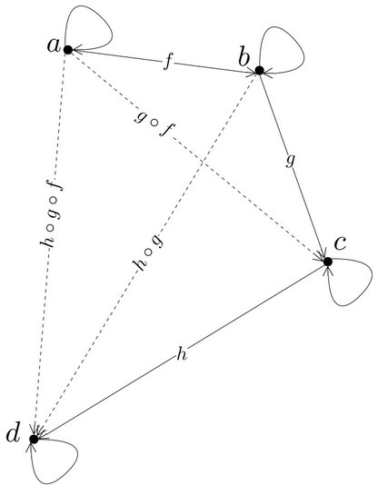
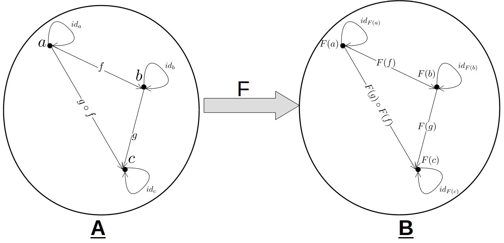
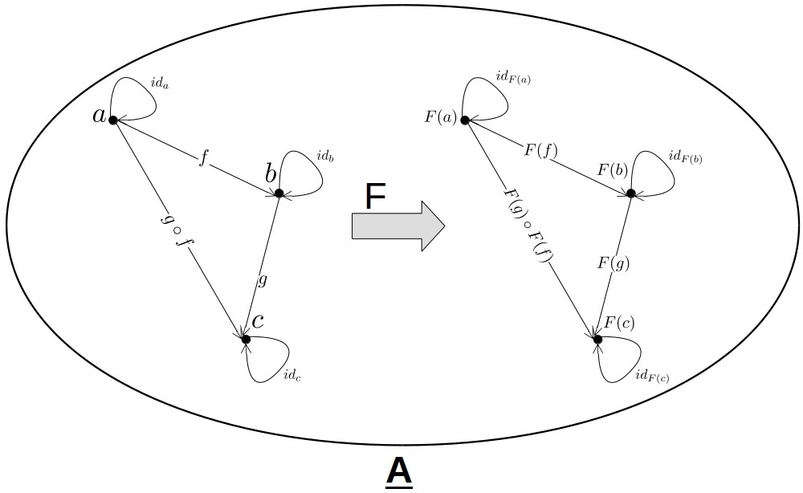

## Agenda

* Introduktion till Funktionell Programmering
* Ren Funktionell Programmering med Haskell
  * massvis av ~~abstrakt nonsens~~ kod.
* Live-kod

<div class="notes">
This is my note.

- It can contain Markdown
- like this list

</div>

## Motiverande exempel 

Imperativa program kan vara svåra att resonera om.

. . .

```{.c}
int method(int arg) {
  print(arg);
  return arg * 2;
}

int program(int arg) {
  return (method(arg) + method(arg));
}
```

. . .

```{.c}
int method(int arg) {
  print(arg);
  return arg * 2;
}

int program(int arg) {
  int result = method(arg);
  return (result + result);
}
```

## Vad är funktionell programmering?

```{.c}
int method(int arg) {
  return arg * 2;
}

int program(int arg) {
  int result = method(arg);
  return (result + result);
}
```

## Ekvationella resonemang 

Funktionell programmering och referenstransparens möjliggör för </br>
ekvationella resonemang om ett programs egenskaper.

. . .

I Haskell defineras en funktion som en ekvation.

```{.haskell}
square x = x * x

p = square 2
```

. . .

Likhet innebär att vi kan substituera square x för x * x och vice versa.
```{.haskell}
p = 2 * 2
```

. . .

```{.haskell}
p = 4
```

. . .

Ett Haskell-program är ett enda stort referentiellt transparent uttryck.

## En funktion har följande egenskaper 

. . .

* Total

. . .

* Deterministisk

. . .

* Inga sido-effekter


## Vad är Haskell?
* Rent, funktionell programmeringsspråk med lat evaluering.
* Släpptes första gången år 1990.
* Stark statisk typning med typinferens.
* Tolkat såväl som kompilerat.
  * GHCi är en REPL där Haskell-kod kan tolkas.
  * Källkod simpliferas till GHC-Core och optimeras.
    * GHC-Core är en typad lambdacalculus kallad System FC
  * GHC-Core kompileras till maskinkod.
* Utbyggbart per design.


## Ren Funktionell Programmering <br/> med haskell


## Haskell och IO

I Haskell är en effekt ett första-klassens värde.
```{.haskell}
getLine :: IO String             -- En effekt som producerar en `String`

putStrLn :: String -> IO ()      -- En funktion från `String` till en effekt
```

Det enda sättet att exekvera en effekt är genom att likställa den med main.

```{.haskell}
module Main where

x = putStrLn "Goodbye World"

main :: IO ()
main = putStrLn "Hello World"
```

```
> ./example
Hello World
```

## Högre ordningens funktioner

```{.haskell}
> filter (\x -> x <= 5) [1..10]
[1,2,3,4,5]
```

. . .

```{.haskell}
> filter (<= 5) [1..10]
[1,2,3,4,5]
```

## Högre ordningens funktioner

\\((f \\circ g) x = f (g(x))\\)

. . .

```{.haskell}
(.) :: (b -> c) -> (a -> b) -> (a -> c)
```

. . .

```{.haskell}
reverseSort :: [a] -> [a]
reverseSort = reverse . sort
```

```{.haskell}
> reverseSort [4,1,2] -- reverse (sort [4,1,2])
[4,2,1]
```

## Parametrisk polymorfism

```{.haskell}
(.) :: (b -> c) -> (a -> b) -> (a -> c)
```

. . .

```{.haskell}
id :: a -> a 
```
. . .

```{.haskell}
const :: a -> b -> a
```
. . .

```{.haskell}
fst :: (a, b) -> a 
```
. . .

```{.haskell}
flip :: (a -> b -> c) -> b -> a -> c
```

## Ad-hoc polymorfism

```{.haskell}
(+) :: Num a => a -> a -> a 
```

```{.haskell}
(==) :: Eq a => a -> a -> Bool
```

```{.haskell}
compare :: Ord a => a -> a -> Ordering
```

## Algebraiska datatyper

Algebraiska datatyper formar en algerbra med två operationer, summa och produkt.
```{.haskell}
data Bool = True | False
```
. . . 

```{.haskell}
data Pair a b = Pair a b
```
. . .

```{.haskell}
data Tree a = Empty | Node (Tree a) a (Tree a)
```
. . .

```{.haskell}
data [] a = [] | a : [a] 
```

## Algebraiska datatyper och funktioner

```{.haskell}
not :: Bool -> Bool
not True  = False
not False = True 
```
. . .

```{.haskell}
first :: Pair a b -> a
first (Pair a b) = a
```
. . .

List är en rekursiv datatyp, här använder vi rekursion för att beräkna längden.
```{.haskell}
length :: [a] -> Int
length []          = 0
length (head:tail) = 1 + length tail
```

## Lat evaluering

```{.haskell}
> take 5 [1..]
[1,2,3,4,5]
```
. . .

```{.haskell}
> take 5 . tail $ [1..]
[2,3,4,5,6]
```
. . .

</br>
```{.haskell}
fibs = 0 : 1 : zipWith (+) fibs (tail fibs)
```
. . .

```{.haskell}
> take 10 fibs
[0,1,1,2,3,5,8,13,21,34]
```
. . .

```{.haskell}
> fibs !! 100 
354224848179261915075
```

## Kinds

Haskell's kindsystem kan beskrivas som ett typsystem för typer.
Kinds ger oss ett sätt att beskriva vilken typ en typ har.
. . .

```{.haskell}
> :kind Int
Int :: *
```
. . .

```{.haskell}
> :kind [] 
[] :: * -> *
```
. . .

```{.haskell}
> :kind [Int] 
[Int] :: *
```

## Higher-kinded types 

Begreppet Higher-kinded types härleds från Higher-order functions, funktioner
som tar en annan funktion som argument. En typkonstruktor är _higher-kinded_
eftersom den tar en annan typ som argument.

. . .

```{.haskell}
data Maybe a = Nothing | Just a
```
. . .

```{.haskell}
> :kind Maybe
Maybe :: * -> *
```
. . .

```{.haskell}
> :kind Maybe Int
Maybe Int :: *
```


## Typeclasses

En algebra beskriver en mängd med ett antal operationer. I Haskell implementeras
algebras med typeclasses.

## Num

```{.haskell}
class Num a where
  (+) :: a -> a -> a
  (-) :: a -> a -> a
  (*) :: a -> a -> a
```
. . .

```{.haskell}
instance Num Int where
  x + y = ... 
  x - y = ...
  x * y = ...
```
. . .

```{.haskell include=src/examples/Examples.hs snippet=simple-sum-product}
```

## Semigroup & Monoid

En semigroup är en algebra med en associativ binär operation.

```{.haskell}
class Semigroup a where
  (<>) :: a -> a -> a
```
. . .

## Semigroup & Monoid

En monoid är en semigroup med ett identitetselement.

```{.haskell}
class Semigroup a => Monoid a where
  mempty  :: a
  mappend :: a -> a -> a
```

 <table style="width:100%">
  <th colspan=3>Exempel</th>
  <tr>
    <th>Typ</th>
    <th>Operation</th>
    <th>Identitetselement</th>
  </tr>
  <tr>
    <td>Int</td>
    <td>+</td>
    <td>0</td>
  </tr>
  <tr>
    <td>Int</td>
    <td>*</td>
    <td>1</td>
  </tr>
  <tr>
    <td>Bool</td>
    <td>&&</td>
    <td>True</td>
  </tr>
  <tr>
    <td>String</td>
    <td>++</td>
    <td>""</td>
  </tr>
  <tr>
    <td>a ```->``` a</td>
    <td>.</td>
    <td>id</td>
  </tr>
</table> 

## Semigroup & Monoid

```{.haskell}
> "foo" <> "bar"
"foobar"
```
. . .

```{.haskell}
> [1,2,3] <> mempty
[1,2,3]
```
. . .

```{.haskell}
> [1,2,3] <> [4,5,6]
[1,2,3,4,5,6]
```
. . .

## Semigroup & Monoid

```{.haskell}
instance (Monoid a, Monoid b) => Monoid (a, b) where
  mempty = (mempty, mempty)
  
  mappend (a1, a2) (b1, b2) = (mappend a1 b1, mappend a2 b2)
```
. . .

```{.haskell}
> ("Foo", "Hello") <> ("Bar", "World")
("FooBar","HelloWorld")
```
. . .

## Semigroup & Monoid

```{.haskell}
instance (Monoid b) => Monoid (a -> b) where
  mempty = \_ -> mempty
  
  mappend f g = \x -> mappend (f x) (g x)
```
. . .

```{.haskell}
> (id <> reverse) [1,2,3] 
[1,2,3,3,2,1]
```

## Foldable

_Higher-kinded types_ låter oss abstrahera över typkonstruktors. </br>
Här är 't' en typkonstruktor av kind: ```* -> *```

```{.haskell}
class Foldable (t :: * -> *) where
  foldr :: (a -> b -> b) -> b -> t a -> b
```
. . .

Folds är strukturella transformationer.

```{.haskell}
1 : 2 : 3 : []
```
. . .

```{.haskell}
1 + 2 + 3 + 0
```
. . .

```{.haskell}
1 * 2 * 3 * 1
```

## Foldable

```{.haskell}
sum :: (Foldable t, Num a) => t a -> a
sum xs = foldr (+) 0 xs
```
. . .

```{.haskell}
product :: (Foldable t, Num a) => t a -> a
product xs = foldr (*) 1 xs
```
. . .

```{.haskell}
instance Semigroup [a] where
  xs <> ys = foldr (:) ys xs
```
. . .

```{.haskell}
summarize :: (Foldable f, Monoid m) => f m -> m
summarize fm = foldr (<>) mempty fm
```

## Categories 101

En kategori är en algebraisk struktur för att modellera objekt och deras
relationer. En kategori **C** består av en samling objekt och pilar mellan objekt.



## Functor

Inom kategoriteori är en Functor **F** en transformation mellan två kategorier
**A** och **B**.



## Functor
En functor **F** som transformerar en kategori **A** till sig själv kallas för
endofunctor.



## Functor

```{.haskell}
g :: a -> b
```
. . .

```{.haskell}
gMaybe :: Maybe a -> Maybe b
gMaybe Nothing  = Nothing
gMaybe (Just x) = Just (g x)
```
. . .

```{.haskell}
gList :: [a] -> [b] 
gList []     = []
gList (x:xs) = g x : fList xs
```

## Functors i Haskell

En typkonstruktor `* -> *` i kategorin Haskell vars objekt är typer och funktioner i Haskell.

. . .

```{.haskell}
class Functor (f :: * -> *) where
  fmap :: (a -> b) -> f a -> f b
```
. . .

```{.haskell}
fa = Just 1 
```
. . .

```{.haskell}
fa = [1] 
```

## Functor

```{.haskell}
> :type g
g :: a -> b
```
. . .

```{.haskell}
> :type fmap g 
fmap g :: (Functor f) => (f a -> f b)
```
. . .

```{.haskell}
instance Functor Maybe where
  fmap f Nothing  = Nothing
  fmap f (Just x) = Just (f x)
```

## Functor

```{.haskell}
> fmap (+ 1) (Just 1)
Just 2
```
. . .

```{.haskell}
> fmap (+ 1) Nothing 
Nothing
```
. . .

```{.haskell}
> fmap (+ 1) [1,2,3] 
[2,3,4]
```
. . .

```{.haskell}
> (fmap . fmap) (+ 1) [Just 1, Nothing, Just 2] 
[Just 2, Nothing, Just 3]
```
. . .

```{.haskell}
> (fmap . fmap) (+ 1) (Just [1,2,3]) 
Just [2,3,4]
```

## Applicative

Applicatives är monoidal functors. 

```{.haskell}
class Functor f => Applicative (f :: * -> *) where
  pure  :: a -> f a
  (<*>) :: f (a -> b) -> f a -> f b
```

. . .

```{.haskell}
  fmap  ::   (a -> b) -> f a -> f b
  (<*>) :: f (a -> b) -> f a -> f b
```

## Monad

I Haskell används ofta monads för att simulera effektfulla beräkningar på ett
rent funktionellt sätt.
. . .

```{.haskell}
f :: Int -> Maybe Int
g :: Int -> Maybe Int

p = f (g 1) -- Kompilerar ej.
```
. . .

```{.haskell}
> :t fmap f (g 1)
fmap f (g 1) :: Maybe (Maybe Int)
```

## Monad
```{.haskell}
join :: Monad f => f (f a) -> f a
```
. . .

```{.haskell}
fa >>= f = join (fmap f fa)
```
. . .

```{.haskell}
class Applicative f => Monad (f :: * -> *) where
  return :: a -> f a
  (>>=)  :: f a -> (a -> f b) -> f b
```

Operationen `(>>=)` för monads låter oss applicera en funktion: \\(a \\rightarrow f\\ b\\) till
ett argument: \\(f\\ a\\)

## Exempel på Monads i Haskell
* List
* Maybe 
* Either 
* Reader
* Writer
* State
* IO

## Komma igång 
[http://www.haskell.org/downloads](http://www.haskell.org/downloads)

* **Haskell Stack**
* Haskell Platform
* GHC

## Böcker

```{=html}
<div class="row">
  <div class="column">
    
  </div>
  <div class="column">
    
  </div>
  <div class="column">
    
  </div>
</div>
```

## Live kod

