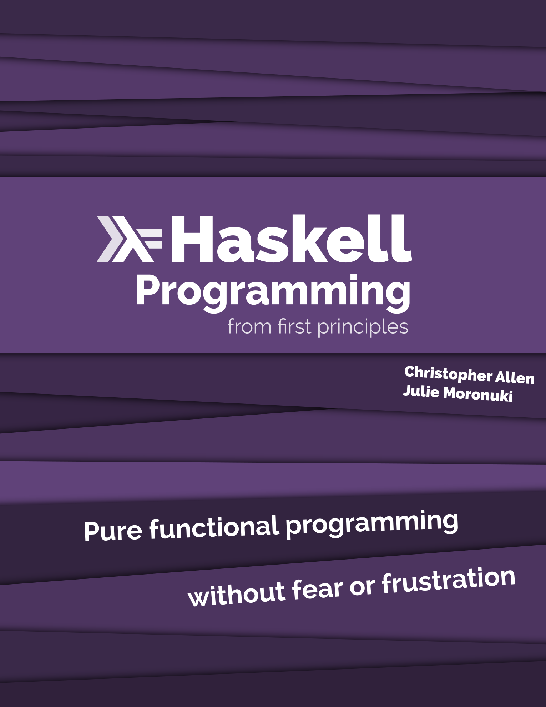

## Agenda

* Introduktion till Funktionell Programmering
* Ren Funktionell Programmering med Haskell
* Live-kod

<div class="notes">
This is my note.

- It can contain Markdown
- like this list

</div>

## Programmera med matematiska funktioner

En funktion \\( f : A \\rightarrow B \\) är en relation från \\(A\\) till
\\(B\\) som definerar exakt ett element i \\(B\\) till varje element i \\(A\\).

```{.haskell}
data A = A1 | A2 

data B = B1 | B2

f :: A -> B
f A1 = B1
f A2 = B2
```


## Referenstransparens

I Haskell, när vi ser ett likhetstecken innebär detta att vi alltid kan
substituera ett uttryck med dess värde och vice versa. Detta kallas ofta för _referenstransparens_.

```{.haskell}
square x = x * x

p = square 2
```
. . .
```{.haskell}
p = 2 * 2
```
. . .
```{.haskell}
p = 4
```
Dubbelriktad substitution är alltid möjligt eftersom Haskell är rent.</br>
Ett Haskell-program är ett enda stort referentiellt transparent uttryck.

## Refaktorering
Eftersom vi inte behöver ta hänsyn till sido-effekter kan vi alltid simplifiera
ett program utan att dess egenskaper förändras.

```{.haskell}
p = f x + f y * (f x - f x)
```
. . . 

```{.haskell}
p = f x + f y * 0
```

. . . 

```{.haskell}
p = f x + 0
```

. . . 

```{.haskell}
p = f x
```

## Ekvationella resonemang
Funktionell programmering och referenstransparens möjliggör för ekvationella
resonemang om ett programs egenskaper.

```{.haskell}
reverse :: [a] -> [a]
reverse []     = []
reverse (x:xs) = reverse xs ++ [x]
```
. . . 

Vi kan bevisa att: \\(\\forall x. reverse [x] = [x]\\)

```{.haskell}
reverse [x]
reverse (x: [])
reverse [] ++ [x]
[] ++ [x]
[x]
```

## Komposition

\\((f \\circ g) x = f (g(x))\\)

. . .
```{.haskell}
(.) :: (b -> c) -> (a -> b) -> (a -> c)
```

. . .
```{.haskell}
reverseSort :: [a] -> [a]
reverseSort = reverse . sort
```

```{.haskell}
> reverseSort [4,1,2] -- reverse (sort [4,1,2])
[4,2,1]
```
Med sido-effekter hade komposition ej vart möjligt.

## Vad är Haskell?
* Släpptes första gången år 1990.
  * Haskell 1.0 (1990)
  * Haskell 2010 (Senaste)
  * GHC 8.6.3 (December 2018)
  * Fick sitt namn efter den amerikanska logikern Haskell Curry
* Rent, funktionell programmeringsspråk med lat evaluering.
* Stark statisk typning med typinferens.
* Tolkat såväl som kompilerat.
  * GHCi är en REPL där Haskell-kod kan tolkas.
  * Källkod simpliferas till GHC-Core och optimeras.
    * GHC-Core är en typad lambdacalculus kallad System FC
  * GHC-Core kompileras till maskinkod.
* Utbyggbart per design.
* Ledande inom programmeringsspråk-utveckling.

## Komma igång 
[http://www.haskell.org/downloads](http://www.haskell.org/downloads)

* **Haskell Stack**
* Haskell Platform
* GHC

## Böcker

```{=html}
<div class="row">
  <div class="column">
    
  </div>
  <div class="column">
    
  </div>
  <div class="column">
    
  </div>
</div>
```

## Sido-effekter

I Haskell är en effekt ett första-klassens värde.
```{.haskell}
getLine :: IO String             -- En effekt som producerar en `String`

putStrLn :: String -> IO ()      -- En funktion från `String` till en effekt
```

Det enda sättet att exekvera en effekt är genom att likställa den med main.

```{.haskell}
x = putStrLn "Goodbye World"

main :: IO ()
main = putStrLn "Hello World"
```

```
> ./example
Hello World
```

## Högre ordningens funktioner

```{.haskell}
(++) :: [a] -> [a] -> [a]
```
. . .
```{.haskell}
exclaim :: String -> String                 -- String är alias för [Char]
exclaim = (++ "!")
```

. . .
```{.haskell}
shout :: String -> String
shout = exclaim . toUpper
```

```{.haskell}
> stack build
error:
    • Couldn't match type ‘Char’ with ‘[Char]’
      Expected type: Char -> [Char]
        Actual type: Char -> Char
    • In the second argument of ‘(.)’, namely ‘toUpper’
      In the expression: exclaim . toUpper
      In an equation for ‘shout’: shout = exclaim . toUpper

```

## Högre ordningens funktioner

```{.haskell}
> :t toUpper
toUpper :: Char -> Char
```
. . .
```{.haskell}
> :t map toUpper :: [Char] -> [Char]
```
. . .


```{.haskell}
shout :: String -> String
shout = exclaim . map toUpper
```

```{.haskell}
> shout "hello" 
"HELLO!"
```

## Parametrisk polymorfism

Typer säger mycket om vad en funktion gör. De kan också guida oss till en korrekt implementation.

```{.haskell}
map :: (a -> b) -> [a] -> [b]
map f as = ...
```
. . .

```{.haskell}
id :: a -> a                -- id :: forall a. a -> a
```
. . .

```{.haskell}
const :: a -> b -> a
```
. . .

```{.haskell}
flip :: (a -> b -> c) -> b -> a -> c
```
"Hole-driven Haskell" är en avancerad teknik där vi använder typer för att låta
kompilatorn guida oss till en korrekt implementation, baserad på bevis.

## Ad-hoc polymorfism

```{.haskell}
(+) :: Num a => a -> a -> a 
```

```{.haskell}
(==) :: Eq a => a -> a -> Bool
```

```{.haskell}
compare :: Ord a => a -> a -> Ordering
```


## 1
```{.haskell include=src/examples/Examples.hs snippet=simple-sum-product}
```
## 2
```{.haskell emphasize=2:14-2:14,3:16-3:16,6:18-6:18,7:20-7:20 include=src/examples/Examples.hs snippet=simple-sum-product}
```

